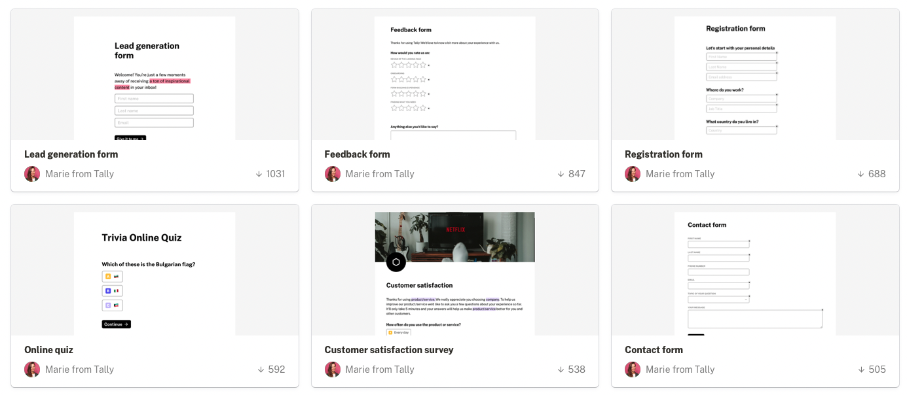
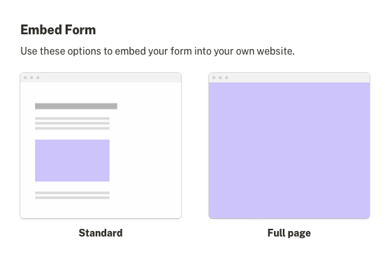
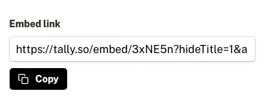

# PORTFOLIO

## Hello, I’m Nithiya Banu K.

I'm passionate about data analytics and problem-solving. Whether it's cleaning and organizing data, finding patterns, or presenting insights visually, I enjoy turning data into meaningful decision.

- Resume
    
    [Nithiya_Banu_K_Resume.pdf](Nithiya_Banu_K_Resume.pdf)
    

## Skills

[Skills](Skills%20198270753cf3812f963beac15c0435a6.csv)

## Projects

[Projects](Projects%20198270753cf381e498f2eb5858485e66.csv)

## Education

|  |  |                     CGPA |
| --- | --- | --- |
|                            PG | Master Of Business Administration (MBA)  | 7.5/10 (Expected                    Graduation: July 2025)  |
|                            UG | Bachelor Of Science ([B.Sc](http://b.sc/).) in Mathematics |                    8.3/10  |
|                           HSC |  |                    8/10 |

## Let’s Work Together

If you're interested in working with me to maximize your efficiency in Notion, please use our contact form.

[https://tally.so/r/wargXn](https://tally.so/r/wargXn)

<aside>
**FAQs**

---

- **How to publish your website**
    1. Click on “Share” on the top right corner
    2. Go to “Publish” and click “Publish.”
    3. Toggle off “Duplicate as template.”
    4. Copy the link to share your website with others.

---

- **How to embed a form in Notion**
    1. Create a free account at [tally.so](https://tally.so/)
    2. Click on create form or use one of the templates
        
        
        
    3. Customise the form
    4. Publish the form
    5. Go to Share, and click on Standard under Embed Form
        
        
        
    6. Copy the Embed link
        
        
        
    7. Create an Embed block in Notion, then paste the link

---

</aside>

---

**Follow me**